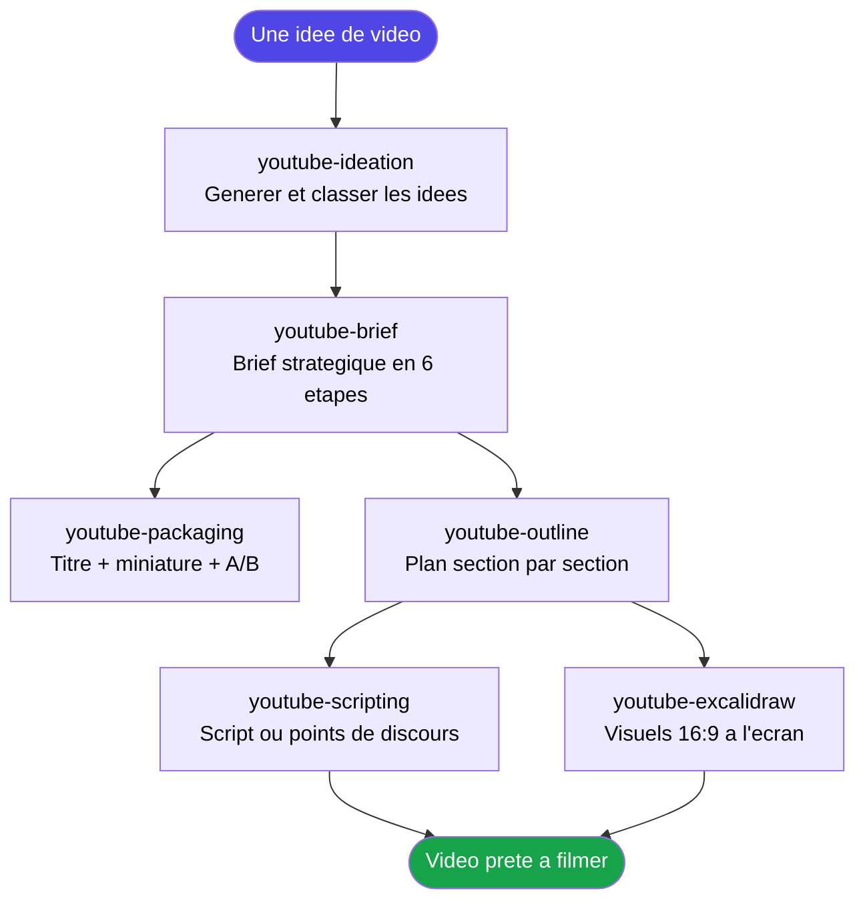

<div align="center">


<a href="https://github.com/Kaaramo/AI5D-Youtube-Plugin">
  
</a>

<br/>


<br/>


</div>

---

<div align="center">

### Transformez une idée vague en vidéo YouTube prête à filmer, à travers une seule conversation.

Un plugin de 7 skills qui vous accompagne pas à pas : trouver le sujet, le briefer stratégiquement, l'emballer pour le clic, le structurer, l'écrire et concevoir les visuels.

</div>

---

## Le problème

La plupart des créateurs allument la caméra trop tôt :

- L'idée est là, mais le **résultat pour le spectateur** n'est jamais défini clairement.
- Le titre et la miniature sont bricolés **après coup**, alors qu'ils décident de 90 % des clics.
- Le tournage part sans plan : résultat, des vidéos **longues, floues et sans focus** qui gaspillent des heures de montage.

Conséquence directe : du temps de production perdu, des vidéos qui ne performent pas, et un savoir de chaîne (ICP, voix, stratégie) qui n'est jamais réutilisé d'une vidéo à l'autre.

## La solution

**AI5D YouTube Plugin** installe un processus complet, de l'idéation au tournage, où chaque étape s'appuie sur la précédente — et sur votre **contexte de marque** (audience, voix, offre, stratégie) stocké une fois pour toutes.

Le plugin ne « pond » pas une vidéo d'un bloc : il vous **suggère, vous décidez, on verrouille, on avance**. À chaque étape, il puise dans vos fichiers de référence pour rester aligné sur votre audience et votre positionnement.

> En une phrase : vous arrivez avec une idée, vous repartez avec un brief, un titre, une miniature, un plan et un script — tous cohérents entre eux et fidèles à votre chaîne.

---

## Les 7 skills

<div align="center">

| Skill | Rôle | Commande |
|:---|:---|:---|
| **youtube-ideation** | Générer et classer des idées de vidéos | `/youtube-ideation` |
| **youtube-brief** | Brief stratégique en 6 étapes | `/youtube-brief` |
| **title-generation** | Titres optimisés pour le CTR | `/title-generation` |
| **youtube-packaging** | Titres + concepts de miniatures + tests A/B | `/youtube-packaging` |
| **youtube-outline** | Plan structuré section par section | `/youtube-outline` |
| **youtube-scripting** | Script complet ou points de discours | `/youtube-scripting` |
| **youtube-excalidraw** | Visuels 16:9 à afficher à l'écran | `/youtube-excalidraw` |

</div>

## Bénéfices clés

- **Zéro page blanche** : chaque skill propose des options, vous choisissez.
- **Processus, pas one-shot** : le brief se construit étape par étape (suggérer → décider → verrouiller → suivant), jamais un dump terminé d'un coup.
- **Aligné sur votre marque** : ICP, voix, offre et stratégie sont lus à chaque décision pour des suggestions sur-mesure.
- **Pensé pour le clic** : titres et miniatures traités comme un système de *packaging*, avec variantes pour A/B test.
- **Cohérence de bout en bout** : le résultat d'une skill alimente directement la suivante.
- **100 % en français.**

---

## Comment ça marche

Le pipeline complet, de l'idée au tournage.



<br/>

<details>
<summary><b>youtube-ideation — Trouver le bon sujet</b></summary>

<br/>

Un brainstorming guidé et fondé sur la recherche. La skill lit votre ICP et votre stratégie, recherche les sujets tendance et les manques de contenu, puis génère **10 idées** classées (axé recherche / tendance / intemporel / contre-pied). Vous choisissez vos favorites, elle produit des mini-briefs et l'ordre de production.

</details>

<details>
<summary><b>youtube-brief — Le cœur stratégique (6 étapes)</b></summary>

<br/>

Le brief définit ce que la vidéo couvre, pourquoi elle mérite d'exister, et quelles preuves l'appuient. Règle d'or : **on ne saute jamais une étape, on ne produit jamais un brief fini avant l'étape 6.**

```mermaid
flowchart LR
    E0[Etape 0<br/>Recueil de l'idee] --> E1[Etape 1<br/>Lire ICP + strategie]
    E1 --> E2[Etape 2<br/>Resultat principal]
    E2 --> E3[Etape 3<br/>Pourquoi c'est important]
    E3 --> E4[Etape 4<br/>Points a couvrir]
    E4 --> E5[Etape 5<br/>Preuves et demos]
    E5 --> E6[Etape 6<br/>Brief final]

    style E0 fill:#ede9fe,color:#000
    style E1 fill:#ede9fe,color:#000
    style E2 fill:#ede9fe,color:#000
    style E3 fill:#ede9fe,color:#000
    style E4 fill:#ede9fe,color:#000
    style E5 fill:#ede9fe,color:#000
    style E6 fill:#4f46e5,color:#fff
```



À chaque étape : des suggestions, votre décision, puis on verrouille. Les étapes 4 et 5 lancent même une recherche dédiée pour nourrir les points et les preuves.

</details>

<details>
<summary><b>title-generation & youtube-packaging — Gagner le clic</b></summary>

<br/>

`title-generation` produit **10 titres** à partir de formules éprouvées (curiosité, tuto + précision, liste à numéro, contre-pied, axé résultat, question, défi, secret, comparaison, autorité), classés par CTR estimé.

`youtube-packaging` va plus loin : pour les titres retenus, il génère **3 concepts de miniatures** (texte en surimpression, concept visuel, émotion, couleurs) et propose des **variantes pour tests A/B**.

</details>

<details>
<summary><b>youtube-outline & youtube-scripting — Structurer puis écrire</b></summary>

<br/>

`youtube-outline` transforme le brief en plan section par section : durées estimées, placement des démos, besoins en visuels, et 2-3 approches d'intro.

`youtube-scripting` part du plan et écrit le matériel de tournage — **script complet**, **points de discours** ou **hybride** — avec accroches, transitions, CTA et indications visuelles en ligne (`[DÉMO: …]`, `[EXCALIDRAW: …]`).

</details>

<details>
<summary><b>youtube-excalidraw — Les visuels à l'écran</b></summary>

<br/>

Crée des visuels excalidraw optimisés YouTube : format **16:9** (1920x1080), texte large et lisible sur mobile, contraste élevé, mises en page simples. Idéal pour les slides d'intro, diagrammes de concepts, flux de processus et résumés.

</details>

---

## Structure du dépôt

```
AI5D-Youtube-Plugin/
├── README.md                     Ce document
├── .claude-plugin/
│   └── plugin.json               Manifeste du plugin
├── .mcp.json                     Serveur MCP (Apify)
└── skills/
    ├── youtube-ideation/         Idees de videos
    ├── youtube-brief/            Brief en 6 etapes
    │   └── references/           Contexte de marque (ICP, voix, offre, strategie, profil)
    ├── title-generation/         Titres optimises CTR
    ├── youtube-packaging/        Titres + miniatures + A/B
    ├── youtube-outline/          Plan structure
    ├── youtube-scripting/        Script / points de discours
    └── youtube-excalidraw/       Visuels 16:9
```

## Le contexte de marque (références)

Le dossier `skills/youtube-brief/references/` est la **source de vérité** lue par les skills pour rester alignées sur vous :

| Fichier | Contenu |
|:---|:---|
| `icp-ideal-customer-profile.md` | Votre audience : douleurs, désirs, segments |
| `voice-personality.md` | Ton, message central, philosophie de contenu |
| `what-we-do-offer.md` | Votre activité, vos produits, votre positionnement |
| `youtube-strategy.md` | Stratégie de chaîne, piliers, ce qui performe |
| `karamo-profile-background.md` | Parcours, jalons, convictions, angles uniques |

> Plus ces fichiers sont précis, plus les suggestions sont fidèles à votre chaîne.

---

## Compatibilité et technologies

<div align="center">


<br/><br/>


</div>

---

## Installation et lancement

1. Clonez ce dépôt :

```
git clone https://github.com/Kaaramo/AI5D-Youtube-Plugin.git
```

2. Installez-le comme plugin dans votre environnement Claude Code (via votre marketplace de plugins ou votre configuration de skills).

3. Personnalisez d'abord le dossier `references/` avec vos vraies données (ICP, voix, offre, stratégie, profil).

4. Lancez le pipeline selon votre besoin :

```
/youtube-ideation      → trouver un sujet
/youtube-brief         → briefer la vidéo
/youtube-packaging     → titre + miniature
/youtube-outline       → structurer
/youtube-scripting     → écrire le script
/youtube-excalidraw    → créer les visuels
```

> Conseil : commencez toujours par remplir `youtube-strategy.md` et l'ICP. Les skills s'appuient dessus à chaque décision — un contexte riche donne des suggestions précises.

---

<div align="center">

### Un contexte de chaîne défini une fois, exploité par votre IA pour chaque vidéo.

<br/>


<br/>

<sub>© AI5D. Tous droits réservés.</sub>


</div>
